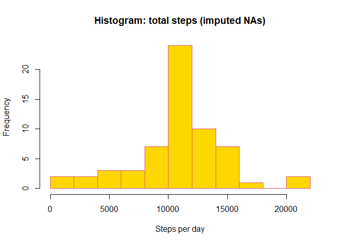
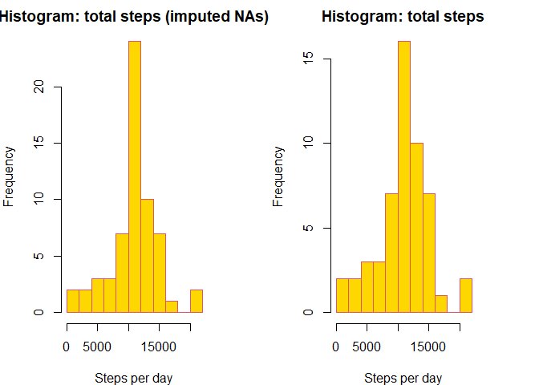
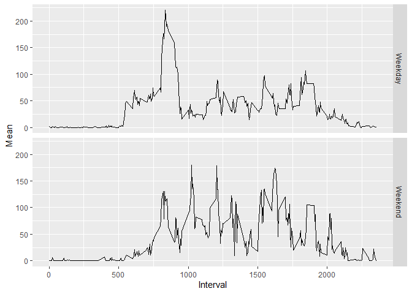

## Loading and preprocessing the data


```r
##load ggplot2
library(ggplot2)
### Unzip the file 

unzip("activity.zip")

##import the data

activity <- read.csv("activity.csv", header = TRUE, 
            sep = ",", colClasses = c("numeric", "Date", 
            "numeric"))
```


## 1. What is mean total number of steps taken per day?


```r
##Create a data frame without NAs
activity_without_NA <- activity[complete.cases(activity),]

##Make date a factor
activity_without_NA$date <- as.factor(activity_without_NA$date)

##Create a variable with the sum of steps per day
total_steps_per_day <- tapply(activity_without_NA$steps,                 activity_without_NA$date, sum)
```


```r
##make an histogram of the daily steps
hist(total_steps_per_day, xlab = "Steps per day", ylab = "Frequency",
     main = "Graph 1: Histogram of total steps per day", col = "gold", border = "10",
     breaks = 15)
```

<!-- -->


```r
##calculate mean and median
mean_steps <- round(mean(total_steps_per_day))
median_steps <- median(total_steps_per_day)
```


The mean (m= 10766) and the median (median = 10765) corrobate what we see on the graph. Most daily values center around the 10.000 to 11.000 break.


## 2. What is the average daily activity pattern?

```r
##calculate mean per day by intervals
mean_averaged_perday <- aggregate(activity_without_NA$steps, by = list(activity_without_NA$interval), mean)

##change the name of the mean_averaged_perday variable
names(mean_averaged_perday) = c("Interval", "Means")
```


```r
library(ggplot2)
##make a time graph
ggplot(mean_averaged_perday, aes(Interval, Means)) + geom_line()
```

<!-- -->

On a 30-day measurement we find that, on average, the highest activity peak falls along the **820 and 850** intervals as can be seen on the following table:


```r
##create a tble with the 10 highest means by interval
print(head(mean_averaged_perday[order(mean_averaged_perday$Means, decreasing = TRUE),]))
```

```
##     Interval    Means
## 104      835 206.1698
## 105      840 195.9245
## 107      850 183.3962
## 106      845 179.5660
## 103      830 177.3019
## 101      820 171.1509
```

**835** is the highest interval with a peak activity of **206.1698113**. In other words the highest activity peak is between 13:00 and 14:20 hours. 

## Imputing missing values

There is a total of `{r sum(is.na(activity$steps))` missing values in the data frame. To substitute them, we are going to replace NAs with the mean of the corresponding interval, as shown in the following code.


```r
##Create a new data frame to impute NAs
activity_imputed <- activity
##With a for loop, check if value is NA and replace with the rounded average of the corresponding interval
for (i in 1:nrow(activity_imputed)) {
      if (is.na(activity_imputed)[i,1] == TRUE){
      activity_imputed[i,1] <- round(mean(activity_without_NA[activity_without_NA$interval==activity_imputed[i,3],1]))
      }
}
```


```r
total_steps_per_day_imputed <- tapply(activity_imputed$steps, 
                                      activity_imputed$date, sum)


hist(total_steps_per_day_imputed, xlab = "Steps per day", ylab = "Frequency",
     main = "Histogram: total steps (imputed NAs)", col = "gold", border = "10",
     breaks = 15)
```

<!-- -->

With a mean of **10765** and a median of **10762** we can see that while the data structure remains largely similar, the maximum frequency has increased, which explains the difference in sizes between the graphics. On the other hand, both the mean and the median of the imputed data decreased slightly.

Check the following graphs for a closer comparison


```r
par(mfcol= c(1,2), mar = c(4,4,2,4))


hist(total_steps_per_day_imputed, xlab = "Steps per day", ylab = "Frequency",
     main = "Histogram: total steps (imputed NAs)", col = "gold", border = "10",
     breaks = 15)
hist(total_steps_per_day, xlab = "Steps per day", ylab = "Frequency",
     main = " Histogram: total steps ", col = "gold", border = "10",
     breaks = 15)
```

<!-- -->

## Are there differences in activity patterns between weekdays and weekends?


```r
##Create a new column for the days
activity_imputed$day <- weekdays(activity_imputed$date)

##Create an empty variable for the for loop
weekends <- NULL

##Do a for loop to code and introduce days as weekdays of weekends
for (i in 1:nrow(activity_imputed)){
      if (activity_imputed[i,4] == "Sunday"){
            weekends[i] <- "Weekend"
      }
      else if (activity_imputed[i,4] == "Sunday"){
            weekends[i] <- "Weekend"
      }
      else{
            weekends[i] <- "Weekday"
      }

}

##Add weekends as a new column to the database
activity_imputed <- cbind(activity_imputed, as.factor(weekends))

##Change the name for the weekday column
names(activity_imputed)[5] <- "Weekday"

##Calculate the average means per day
mean_imputed <- aggregate(activity_imputed$steps, by = list(activity_imputed$interval, activity_imputed$Weekday), mean)

##Change the name for the mean_imputed dataframe
names(mean_imputed) <- c("Interval", "Weekday","Mean")
```


```r
##make a time graph with ggplot faceted by Weekday
ggplot(mean_imputed, aes(Interval, Mean)) + geom_line() + facet_grid(rows = vars(Weekday))
```

<!-- -->
As we can see, in both weekdays and weekends activity trends are similar for the first 500 intervals, the peak mean is higher in weekdays (between the 500 and 900 interval) and then we see higher activity throughout the rest of the day on weekends
