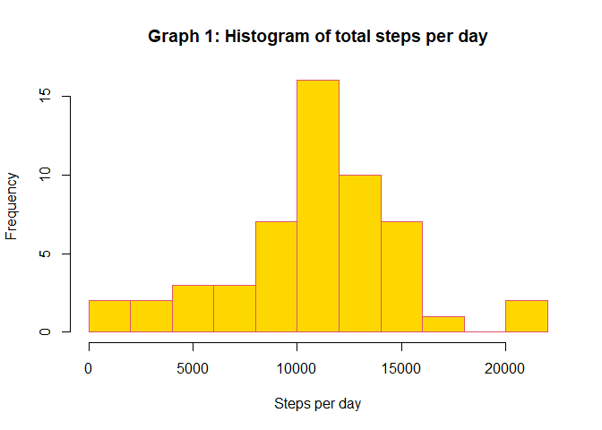
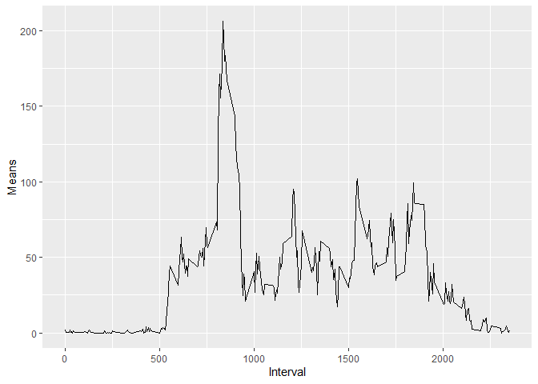

## Loading and preprocessing the data


```r
##load ggplot2
library(ggplot2)
### Unzip the file 

unzip("activity.zip")

##import the data

activity <- read.csv("activity.csv", header = TRUE, 
            sep = ",", colClasses = c("numeric", "Date", 
            "numeric"))
```


## 1. What is mean total number of steps taken per day?


```r
##Create a data frame without NAs
activity_without_NA <- activity[complete.cases(activity),]

##Make date a factor
activity_without_NA$date <- as.factor(activity_without_NA$date)

##Create a variable with the sum of steps per day
total_steps_per_day <- tapply(activity_without_NA$steps,                 activity_without_NA$date, sum)
```


```r
##make an histogram of the daily steps
hist(total_steps_per_day, xlab = "Steps per day", ylab = "Frequency",
     main = "Graph 1: Histogram of total steps per day", col = "gold", border = "10",
     breaks = 15)
```

<!-- -->


```r
mean_steps <- round(mean(total_steps_per_day))
median_steps <- median(total_steps_per_day)
```


The mean (m= 10766) and the median (median = 10765) corrobate what we see on the graph. Most daily values center around the 10.000 to 11.000 break.


## 2. What is the average daily activity pattern?

```r
mean_averaged_perday <- aggregate(activity_without_NA$steps, by = list(activity_without_NA$interval), mean)
names(mean_averaged_perday) = c("Interval", "Means")
```


```r
library(ggplot2)
ggplot(mean_averaged_perday, aes(Interval, Means)) + geom_line()
```

<!-- -->

On a 30-day measurement we find that, on average, the highest activity peak falls along the 820 and 850 intervals as can be seen on the following table:


```r
print(head(mean_averaged_perday[order(mean_averaged_perday$Means, decreasing = TRUE),]))
```

```
##     Interval    Means
## 104      835 206.1698
## 105      840 195.9245
## 107      850 183.3962
## 106      845 179.5660
## 103      830 177.3019
## 101      820 171.1509
```

On average, 835 is the highest interval with a peak activity of 206.1698113. In other words the highest activity peak is between 13:00 and 14:20 hours. 

## Imputing missing values


## Are there differences in activity patterns between weekdays and weekends?
